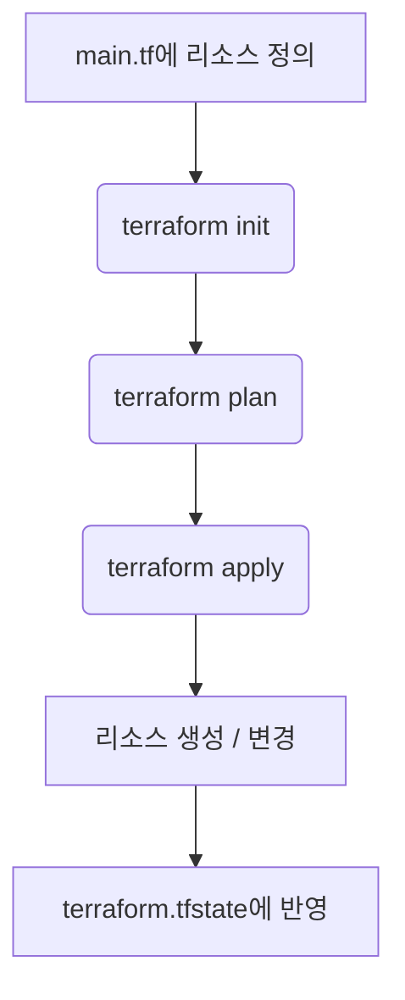

# Terraform

## 등장 배경

- 클라우드 인프라를 구성할 때, 수동 설정은 반복 작업이 많고 오류 발생 가능성이 높음
- 인프라를 코드로 선언하고 관리하면, **버전 관리**, **재사용**, **자동화**가 가능
- AWS, GCP, Azure 등 다양한 클라우드를 지원하는 범용적인 IaC(Infra as Code) 도구가 필요했음

## 동작 원리 및 구조

- Terraform은 선언형 언어(HCL)를 기반으로, 원하는 리소스 상태를 기술함
    
- terraform plan을 통해 실제 리소스와 비교한 변경사항을 확인하고 terraform apply로 인프라를 생성/변경함
- **Provider**(ex. aws, google, azurerm)가 리소스와의 인터페이스 역할을 함
- 내부적으로 .tfstate라는 상태 파일로 현재 인프라 상태를 저장하여, 변경을 추적하고 적용함
    

## 다른 접근 방식과 비교

|방식|특징|장점|단점|
|---|---|---|---|
|**Terraform**|선애형 IaC, 머티 클라우드 지원|머티클라우드, 커뮤니티 활동|상태 파일 관리 필요|
|AWS CloudFormation|AWS 전용|AWS에 최적화, 관리 편의|머티클라우드 불가|
|Pulumi|코드 기반 IaC (Python, TS 등)|익스케 언어 사용 가능|러닝 캡에 클|

## 실제 사용 사례

- AWS Lambda, SQS, IAM, EventBridge 등 다양한 리소스를 자동 배포
- 테스트 환경과 운영 환경의 인프라 구성을 코드로 동일하게 유지 가능
- CI/CD 파이프라인에 통합해서, 인프라 변경을 자동화 및 추적 가능

## 계산되는 이점

- 실수 없는 자동화된 리소스 배포
- Git을 통해 변경 이력 추적 및 협업
- 테스트 및 롤벡 유지 쉽게 가능