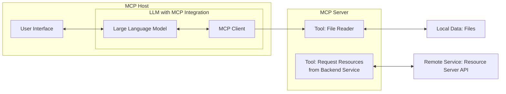

# **MCP (Model Context Protocol)**

## **Model Context Protocol (MCP)는 무엇일까?**

Model Context Protocol (MCP)는 애플리케이션이 대형 언어 모델(LLM)에 컨텍스트 정보를 제공하는 방식을 표준화하는 개방적이고 보편적인 프로토콜이다.

AI Model이 다양한 데이터 소스와 도구에 연결할 수 있도록 만든 프로토콜이다.

우리가 특정 서버에 자원을 가져오려면 HTTP 라는 프로토콜을 통해서 데이터를 가져왔다. MCP도 마찬가지다 AI가 다양한 자원과 데이터를 가져올 수 있도록 만든 프로토콜이다.

## **MCP가 왜 필요한가?**

1. 도메인에 대해서 모른다. LLM은 AI 모델이기 때문에 일반 데이터로만 학습이 되어 있다. 내 서비스에 LLM을 이용하기 위해서는 데이터를 학습시켜줘야 한다.
2. 외부 데이터를 가져올 수 없다. LLM에 추가 정보를 제공하는 데에는 많은 방법들이 있다. 직접 데이터를 학습시키거나, 검색 등 개발자들이 솔루션을 제공해줬다. 도메인에 대한 데이터를 가져올 방법이 없었다.

이러한 이유 때문에 특정 데이터에 일관된 방식으로 접근할 수 있는 MCP와 같은 프로토콜이 필요했다.

## **MCP의 장점은?**

1. 웹에서 HTTP가 데이터를 가져오는 방식처럼, LLM이 외부 지식, 도구, API 등에 접근할 수 있는 공통 인터페이스를 제공한다.
2. RAG(Retrieval-Augmented Generation), 외부 API 호출, 데이터베이스 질의 등 다양한 컨텍스트 소스를하나의 프로토콜을 통해 연결할 수 있다.

RAG란?  
**언어 모델(LLM)** 이 직접 기억하고 있는 정보만 사용하지 않고, 외부 지식 소스를 가져와 대답하는 방식이라고 한다.

## **MCP는 어떻게 작동하나?**

MCP에는 세 가지 핵심 역할이 있다. MCP 서버(도구 및 데이터 액세스 제공), MCP 클라이언트(LLM에 포함되어 MCP 서버와 통신), 그리고 MCP 호스트(Claude Desktop, Cursor 등과 같은 LLM 및 클라이언트를 통합하는 애플리케이션).

### **MCP Client**

MCP Client 의 역할은 LLM과 MCP 서버를 연결하는 브릿지이다.

- 사용자의 요청을 수신
- MCP Server로 요청 전달
- MCP Server로 받은 결과를 LLM에 반환

### **MCP Server**

MCP Server 의 역할은 LLM이 사용할 도구와 데이터를 제공한다.

### **MCP Host**

Claude Desktop, Cursor 와 같은 LLM을 실제로 호출하고 데이터를 액세스하고자 하는 AI 도구를 말한다. 인터페이스를 제공하고 MCP Server가 제공하는 도구를 사용해 LLM 기능을 확장한다.

### **MCP 워크플로우**

## **요약**

기존 방식은 API 명세와 구현에 대한 지식이 있어야 했지만, MCP 덕분에 자연어로도 솔루션을 사용할 수 있게 된다. AI가 중간 인터페이스처럼 작동해서 사용자의 요청을 자동으로 처리할 수도 있게 된다.
